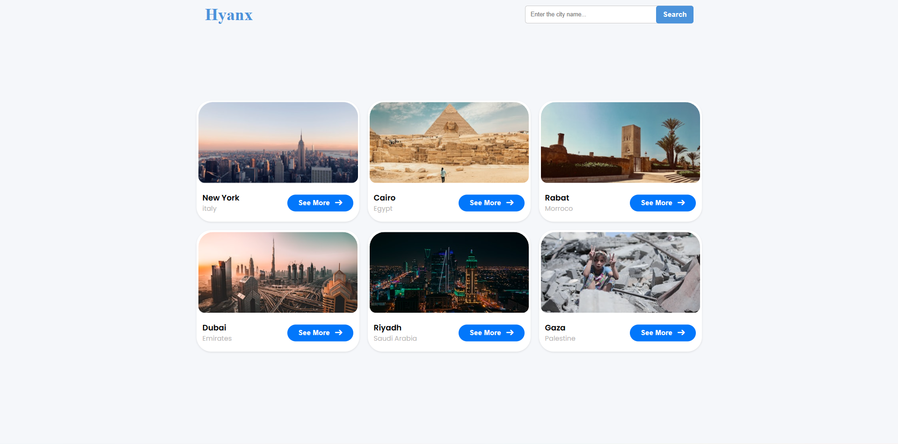

# City Explorer Web App 🌆

A web application that allows users to search for cities, view city information (population, country), and browse images related to the city. Features skeleton loading for smooth user experience and a Swiper gallery for images.

---

## Table of Contents

- [Demo](#demo)
- [Screenshot](#screenshot)
- [Features](#features)
- [Technologies Used](#technologies-used)

---

## Demo

You can see the live demo here: *(Add your deployed link here)*

---

## Screenshot

> Replace `assets/screenshot.png` with the actual path to your screenshot.

---

## Features

- Search for any city by name.
- Display city information:
  - Name
  - Population
  - Country
- Display related images in a Swiper.js gallery.
- Skeleton loading cards for improved UX.
- Error handling for cities not found.
- Responsive design for desktop, tablet, and mobile.
- Click on a city box to view details in a popup overlay.

---

## Technologies Used

- **HTML5** – Structure of the app.
- **CSS3** – Styling, including skeleton loaders.
- **JavaScript (ES6+)** – Fetch API, async/await, event delegation.
- **Swiper.js** – For interactive image gallery.
- **[Unsplash API](https://unsplash.com/developers)** – City images.
- **[API Ninjas City API](https://api.api-ninjas.com/)** – City information (population, country).

